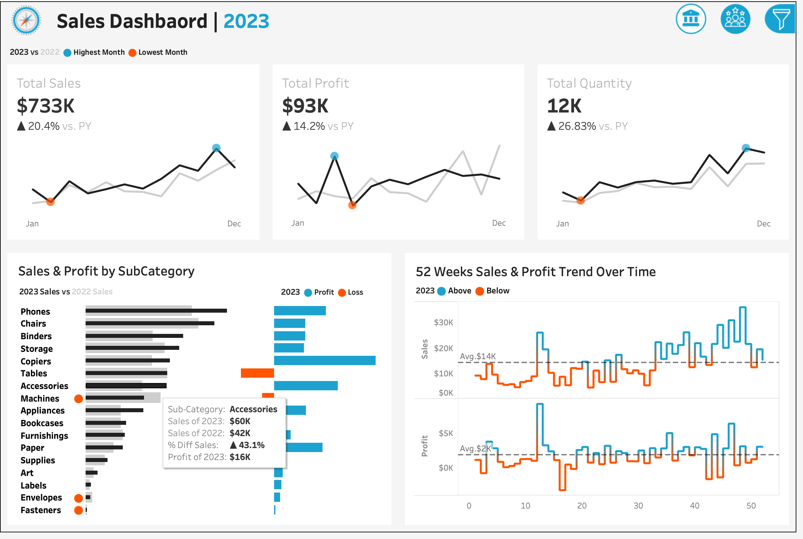
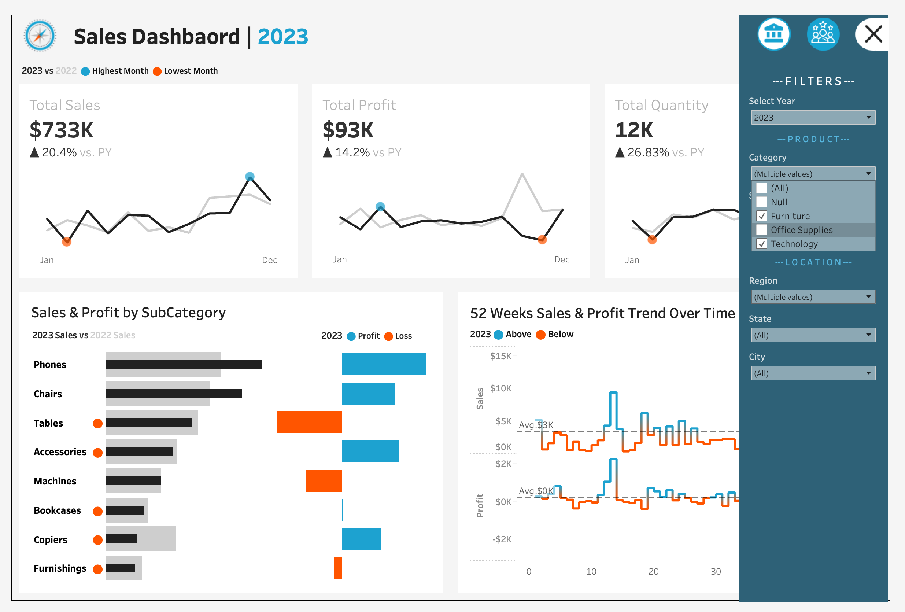
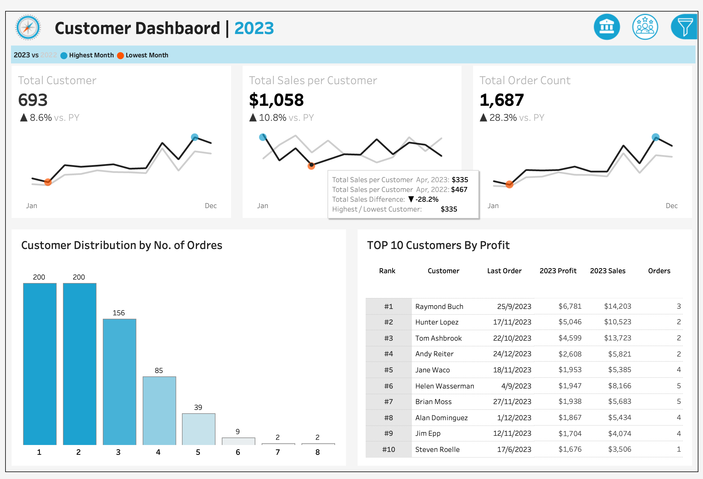
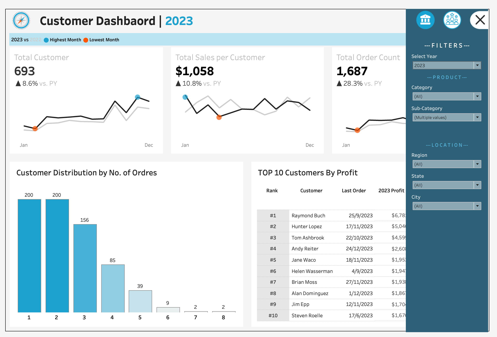

# 📊 Tableau Dashboard: Customer & Sales Analysis

This Tableau project contains two dashboards — **Customer Dashboard** and **Sales Dashboard** — built using a single dataset. The dashboards provide a complete overview of customer behavior, sales trends, and key business KPIs. Created as part of a hands-on project guided by the excellent "Data With Baraa" YouTube series.

---

## ✈️ Customer Dashboard

### 🎯 Purpose
Gives insights into customer data, behavior, and trends. Helps marketing and management teams improve customer segmentation and satisfaction.

### 📌 Features
- **KPI Overview** (current & previous year, with highest and lowest marks):
  - Total customers 
  - Total sales per customer
  - Total orders
- **Customer Distribution by Number of Orders** (Bar Chart)
- **Top 10 Customers by Profit**, with tooltip details:
  - Rank
  - Orders Count
  - Current Year Sales
  - Current Year Profit
  - Last Order Date

---

## 💰 Sales Dashboard

### 🎯 Purpose
Analyzes year-over-year sales performance and product-level trends.

### 📌 Features
- **KPI Overview** (current & previous year, with highest and lowest marks):
  - Total sales, profit, and quantity
- **Product Subcategory Performance** (comparison view)
- **52-Week Sales & Profit Trends**:
  - Includes average line for benchmarks

---

## 📁 Project Files

| File | Description |
|------|-------------|
| `Customer_Sales_Dashboard.twbx` | Tableau workbook containing both dashboards |
| `dashboard-preview.png` | Screenshot of the dashboards (optional) |

---

## 🚀 How to View
1. Download Tableau Public (free): [https://public.tableau.com](https://public.tableau.com)
2. Open `Customer_Sales_Dashboard.twbx`
3. Switch between dashboards via tabs at the bottom

---
## 📸 Preview

## 🙌 Acknowledgements

Thanks to [Data With Baraa](https://www.youtube.com/@DataWithBaraa) for the detailed and practical Tableau tutorials that inspired this project.

---
